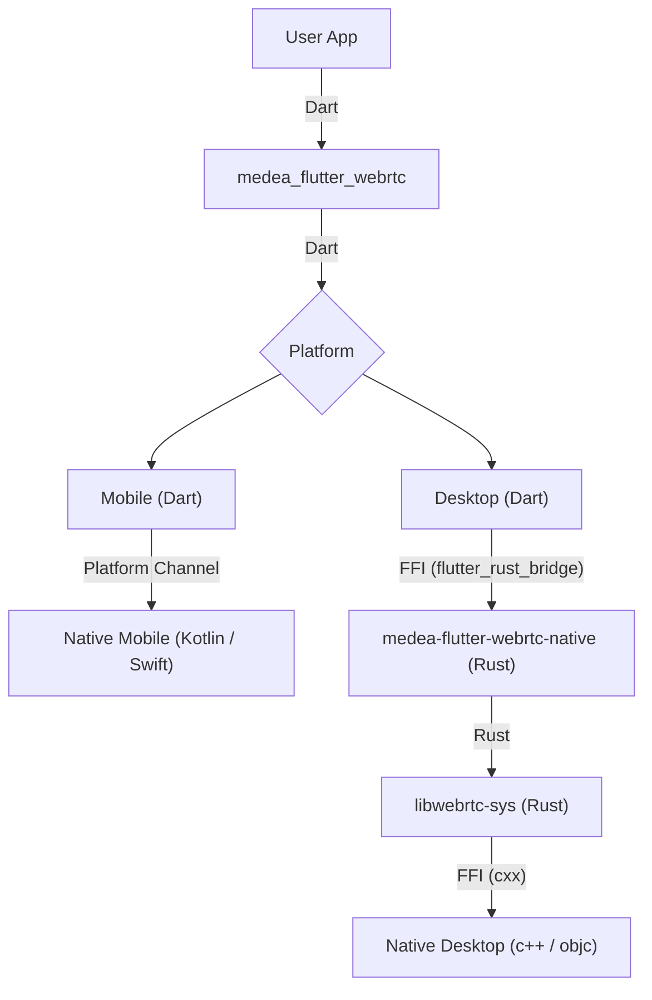

Medea Flutter-WebRTC
====================

[](https://pub.dev/packages/medea_flutter_webrtc)
[](https://github.com/instrumentisto/libwebrtc-bin/releases/tag/112.0.5615.165)

[Changelog](https://github.com/instrumentisto/medea-flutter-webrtc/blob/main/CHANGELOG.md)

[WebRTC] plugin for [Flutter], designed for and used in [Medea Jason WebRTC client], built on top of [prebuilt `libwebrtc` binaries][3].

Initially, represented a fork of the [Flutter-WebRTC] plugin, but at the moment, there is almost nothing left from the [initial upstream version][0] due to a complete rewrite.


## Supported platforms

- [macOS] 10.11+
- [Linux] (with [PulseAudio] and [X11] for screen sharing)
- [Windows] 7+
- [Android] 24+
- [iOS] 13+
- Web (partially, because [Medea Jason WebRTC client] supports browsers aside [Flutter])


## How it works




## Usage

Add `medea_flutter_webrtc` as a [dependency to your `pubspec.yaml` file][4].


### [Android]

Ensure that the following permissions are present in your `AndroidManifest.xml` file, located in `<project_root>/android/app/src/main/AndroidManifest.xml`:
```xml
<uses-feature android:name="android.hardware.camera" />
<uses-feature android:name="android.hardware.camera.autofocus" />
<uses-permission android:name="android.permission.ACCESS_NETWORK_STATE" />
<uses-permission android:name="android.permission.CAMERA" />
<uses-permission android:name="android.permission.CHANGE_NETWORK_STATE" />
<uses-permission android:name="android.permission.INTERNET" />
<uses-permission android:name="android.permission.MODIFY_AUDIO_SETTINGS" />
<uses-permission android:name="android.permission.RECORD_AUDIO" />
```

If you need to use a [Bluetooth] device (like headphones), then also add:
```xml
<uses-permission android:name="android.permission.BLUETOOTH" android:maxSdkVersion="30" />
<uses-permission android:name="android.permission.BLUETOOTH_ADMIN" android:maxSdkVersion="30" />
<uses-permission android:name="android.permission.BLUETOOTH_CONNECT" />
```

The [Flutter] project template usually adds them, so they may already be there.

Also, you will need to set your build settings to [Java 8], because the [official WebRTC JAR] on [Android] uses static methods in `EglBase` interface. Just add this to your app level `build.gradle`:
```groovy
android {
    //...
    compileOptions {
        sourceCompatibility JavaVersion.VERSION_1_8
        targetCompatibility JavaVersion.VERSION_1_8
    }
}
```
If necessary, in the same `build.gradle` you need to increase `minSdkVersion` of `defaultConfig` up to `21` (currently, the default [Flutter] generator sets it to `16`).

> **IMPORTANT**: When you compile the release `.apk`, you need to add the following operations: [Setup Proguard Rules][7].


### [iOS]

Add the following entry to your `Info.plist` file, located in `<project_root>/ios/Runner/Info.plist`:

```xml
<key>NSCameraUsageDescription</key>
<string>$(PRODUCT_NAME) Camera Usage!</string>
<key>NSMicrophoneUsageDescription</key>
<string>$(PRODUCT_NAME) Microphone Usage!</string>
```

These entries allow your app to access camera and microphone.


### Example

For more details, please see the [`medea_flutter_webrtc_example` example][6].


## License

Copyright © 2021-2023 Instrumentisto Team, <https://github.com/instrumentisto>

This Source Code Form is subject to the terms of the [Mozilla Public License, v. 2.0](https://github.com/instrumentisto/medea-flutter-webrtc/blob/main/LICENSE). If a copy of the MPL was not distributed with this file, You can obtain one at <http://mozilla.org/MPL/2.0/>.

The [original upstream source code][0] is licensed under [MIT license][1] with modifications following [Apache License 2.0][2]. 


[`libwebrtc`]: https://webrtc.googlesource.com/src
[Android]: https://www.android.com
[Bluetooth]: https://www.bluetooth.com
[Flutter]: https://www.flutter.dev
[Flutter-WebRTC]: https://github.com/flutter-webrtc/flutter-webrtc
[Java 8]: https://www.oracle.com/java/technologies/java8.html
[iOS]: https://www.apple.com/ios
[Linux]: https://www.linux.org
[macOS]: https://www.apple.com/macos
[Medea Jason WebRTC client]: https://github.com/instrumentisto/medea-jason
[PulseAudio]: https://www.freedesktop.org/wiki/Software/PulseAudio
[WebRTC]: https://webrtc.org
[Windows]: https://www.microsoft.com/windows
[X11]: https://www.x.org

[0]: https://github.com/flutter-webrtc/flutter-webrtc/tree/0.7.0%2Bhotfix.2
[1]: https://github.com/flutter-webrtc/flutter-webrtc/blob/0.7.0%2Bhotfix.2/LICENSE
[2]: https://github.com/flutter-webrtc/flutter-webrtc/blob/0.7.0%2Bhotfix.2/NOTICE
[3]: https://github.com/instrumentisto/libwebrtc-bin
[4]: https://flutter.io/using-packages
[5]: https://webrtc.github.io/webrtc-org/native-code/android
[6]: https://github.com/instrumentisto/medea-flutter-webrtc/tree/main/example
[7]: https://github.com/instrumentisto/medea-flutter-webrtc/blob/main/android/proguard-rules.pro
